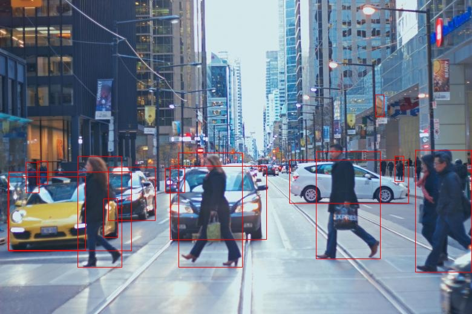

### Description

The project aims to detect objects and faces and recognize faces. It uses the [YOLOv8](https://github.com/ultralytics/ultralytics) model for object detection and the [facenet_pytorch](https://github.com/timesler/facenet-pytorch) package for face detection and recognition. The project can be used via command line and through a web interface.
### Project Structure

```
.
├── models\				
│   └── yolov8n.pt		
├── saved\                  # Default folder to saved images/videos
├── saved_faces\            # Default folder to saved faces
│   ├── embeddings\
│   ├── images\
├── src\					# Source files
│   ├── static\			    # Web Interface files
│   │   ├── script.js	
│   │   └── styles.css
│   ├── templates\		    # Web Interface files
│   │   └── index.html	
│   ├── gui.py			
│   ├── model.py			
│   ├── predict.py		
│   ├── save_face.py		
├── .env					
├── .gitignore
├── README.md		
└── requirements.txt
```
### Installation

1. **Clone the repo**
	```sh
	git clone https://github.com/LucasSchurer/ObjectFaceDetection.git
	```
2. **Install packages**
	```
	pip install -r requirements.txt
	```
3. **Create and edit .env**
	Create a `.env` file in the root directory of the project and add the following environment variables: 
	 * **PREDICTION_OUTPUT_DIR**: Directory to save prediction output files.
	 * **SAVE_FACES_EMBEDDING_DIR**: Directory to save known face embeddings.
	 * **SAVE_FACES_IMAGES_DIR**: Directory to save known faces images.
### Usage
#### Prediction

```
python predict.py [input]
```

Required arguments:

* **input**: path to image (png, jpg) or video that will be processed.

Optional arguments:

| Parameter | Default                                                                          | Description                                                                                                                                                                                                        |
| --------- | -------------------------------------------------------------------------------- | ------------------------------------------------------------------------------------------------------------------------------------------------------------------------------------------------------------------ |
| input     | **Required**                                                                     | image (png, jpg) or video (mp4) to be processed                                                                                                                                                                    |
| -o        | File with a timestamp and same name as the input in the default output directory | path to processed file                                                                                                                                                                                             |
| -y        | ../model/yolov8n.pt                                                              | path or yolo model name used for object detection                                                                                                                                                                  |
| -nf       | Number of frames of input video                                                  | number of frames to process from video                                                                                                                                                                             |
| -do       | False                                                                            | if object detection should be used                                                                                                                                                                                 |
| -dot      | 0.7                                                                              | won't use objects which prediction confidence score are below the threshold                                                                                                                                        |
| -docls    | False                                                                            | if object classification label should be drawn                                                                                                                                                                     |
| -doconf   | False                                                                            | if object classification confidence should be drawn                                                                                                                                                                |
| -df       | False                                                                            | if face detection should be used                                                                                                                                                                                   |
| -dft      | 0.7                                                                              | won't use faces which prediction confidence score are below the threshold                                                                                                                                          |
| -dfconf   | False                                                                            | if face detection confidence should be drawn                                                                                                                                                                       |
| -rf       | False                                                                            | if face recognition should be used                                                                                                                                                                                 |
| -rft      | 0.7                                                                              | threshold used to determine whether a face matches another face. Higher values will produce more matches, but they may be less accurate. Lower values will result in fewer matches, but they will be more accurate |
| -rftm     | best                                                                             | - all: All matches are returned<br>- best: Only the face with the lowest distance (higher accuracy) will be returned<br>- first: First known face which matches the face      will be returned                     

##### Examples
###### Object Detection
1. 
```
python predict.py ../test_data/street.jpg -o ../saved/object_detection/street.jpg -do -dot 0.4
```

2. 
```
python predict.py ../test_data/street.jpg -o ../saved/object_detection/street_cls.jpg -do -dot 0.4 -docls
```

3. 
```
python predict.py ../test_data/street.jpg -o ../saved/object_detection/street_conf.jpg -do -dot 0.4 -doconf
```

4. 
```
python predict.py ../test_data/street.jpg -o ../saved/object_detection/street_all.jpg -do -dot 0.4 -docls -doconf
```

5. 
```
python predict.py ../test_data/street_video.mp4 -o ../saved/object_detection/street_video.mp4 -nf 1000 -do -docls -dot 0.6
```


*The video wasn't uploaded to the repository because of its size*.
###### Face Detection
1. 
```
python predict.py ../test_data/people.jpg -o ../saved/face_detection/people.jpg -df
```

2. 
```
python predict.py ../test_data/people.jpg -o ../saved/face_detection/people.jpg -df -dfconf
```

3. 
```
python predict.py ../test_data/people.jpg -o ../saved/face_detection/people.jpg -df -dfconf -dft 0.9
```

###### Face Recognition
1. 
```
python predict.py ../test_data/steve_jobs_bill_gates.jpg -o ../saved/face_recognition/steve_jobs_bill_gates.jpg -rf -rf 1.2 -rfmt all
```

2. 
```
python predict.py ../test_data/steve_jobs_bill_gates.jpg -o ../saved/face_recognition/steve_jobs_bill_gates_hight.jpg -rf -rf 5 -rfmt all
```


###### Object and Face Detection
1. 
```
python predict.py ../test_data/street_people.png -o ../saved/street_people.png -do -docls -dot 0.3 -df -dfconf -dft 0.8
```

#### Save Faces

```
python save_faces.py [name] [input]
```

Required arguments:

* **name**: name of the face. Full names can be separated by underscore (\_) and without capitalization. When drawing the known face, every word will be capitalized.
* **input**: path to image (png, jpg) or video that will be processed.

#### Web Interface

```
python gui.py
```

The web interface will run on `localhost:5000` and can be used to real time object and face detection, as well as face recognition. If the application can't access the webcam (either because there isn't one connected or because of permissions), a black image will be displayed and none of the functionalities will work.

![[web_interface.png]]